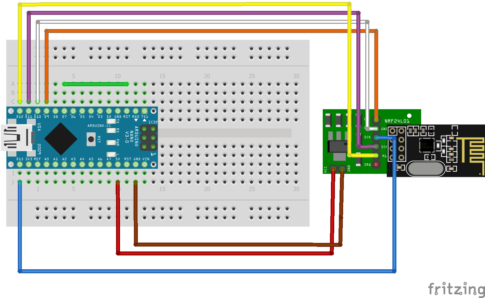

# TFS Nano Nordic Transceiver

This project is a transceiver that utilizes the NRF24 module and an Arduino Nano for communication with TFS machines.

## Dependencies

The following libraries are required for this project:

- [RF24](https://github.com/nRF24/RF24) by TMRh20
  - Install using Library Manager or manually with version ^1.4.7
- [ArduinoJson](https://github.com/bblanchon/ArduinoJson) by Benoit Blanchon
  - Install using Library Manager or manually with version ^6.21.3

## Hardware

### Arduino Nano

The Arduino Nano is a compact and versatile microcontroller board based on the ATmega328P. It is similar to the Arduino Uno but in a smaller form factor, making it ideal for projects with space constraints.

### NRF24 Module

The NRF24 module is a 2.4GHz RF transceiver module that provides a convenient way to establish wireless communication between devices. It is commonly used in Arduino projects for wireless communication.

### NFR24 Expansion Board

The NRF24 Expansion Board serves as a voltage regulator, accepting supply voltages from 1.9 to 3.6V. It provides a regulated voltage output compatible with the NRF24 module, which has inputs tolerant to 5V, allowing direct connection of SPI pins to (compatible with) Arduino IDE. This board ensures stable power supply within the required voltage range for proper functioning of the NRF24 module.
 
### USB Cable

A USB cable compatible with the Arduino Nano's USB port is required for programming and serial communication with a computer. Ensure that the USB cable supports data transfer, not just charging.

### Dupont Cables

Dupont cables are used for connecting various components in electronics projects. They are commonly used to establish connections between Arduino boards and sensors, modules, or other electronic components.

## How to Build

To build this project, follow these steps:

1. **Hardware Assembly:**
   - Connect the NRF24 Expansion Board to the NRF24 module and provide power within the specified voltage range.
   - Connect the NRF24 module to the Arduino Nano using Dupont cables.
   - Connect the Arduino Nano to your computer using the USB cable.

2. **Software Compilation:**
   - Open the project folder in Visual Studio Code.
   - Ensure that PlatformIO is installed and configured in Visual Studio Code.
   - Compile the code using the PlatformIO build system.
   - Upload the code to the board